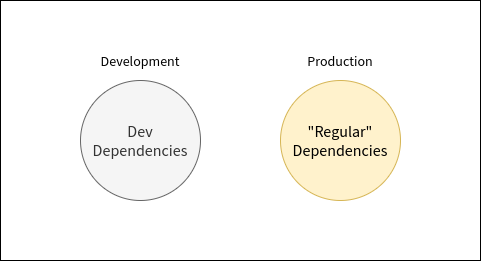

% OSE Workbench Platform
% Introduction

### Overview

* What?
* Why?
* How?

---

### What is OSE Workbench Platform?

* A foundation for development
* A CLI for common development tasks.
* A catalog of patterns for how to develop a workbench using FreeCAD.

---

---

`$ osewb`

<!--
* Run all unit tests - `osewb test`
* Lint code - `osewb lint`
* Build documentation - `osewb docs`
* Generate code - `osewb make`
* ... and more! Use `osewb -h`
 -->
---

`$ osewb test`

---

`$ osewb lint`

---

`$ osewb docs`

---

`$ osewb make`

---

`$ osewb -h`

---

### A Catalog of Patterns

[https://ose-workbench-platform.readthedocs.io/en/latest/](https://ose-workbench-platform.readthedocs.io/en/latest/)

### Why?

* Provide a common tool-set and vocabulary
* Avoid duplication of efforts
* Keep OSE workbench developers focused on the domain
* Make it easier for OSE workbench developers to collaborate together

---

### How?

* Conda
* CLI

---

### What's Next?

* Getting Started & Installation
